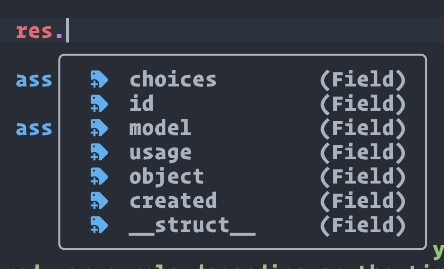
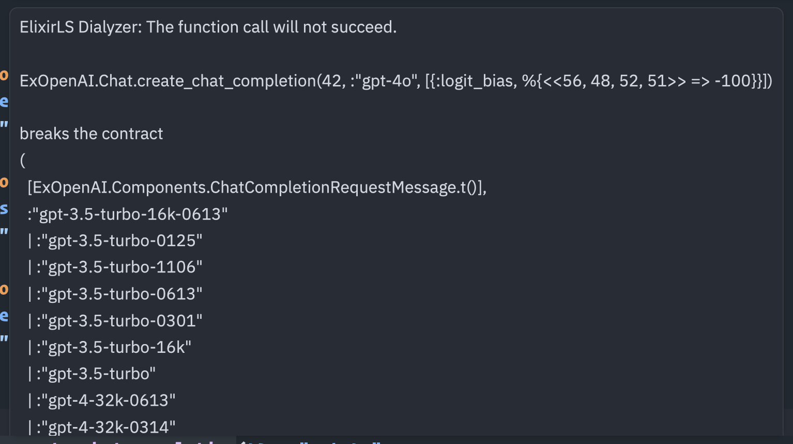
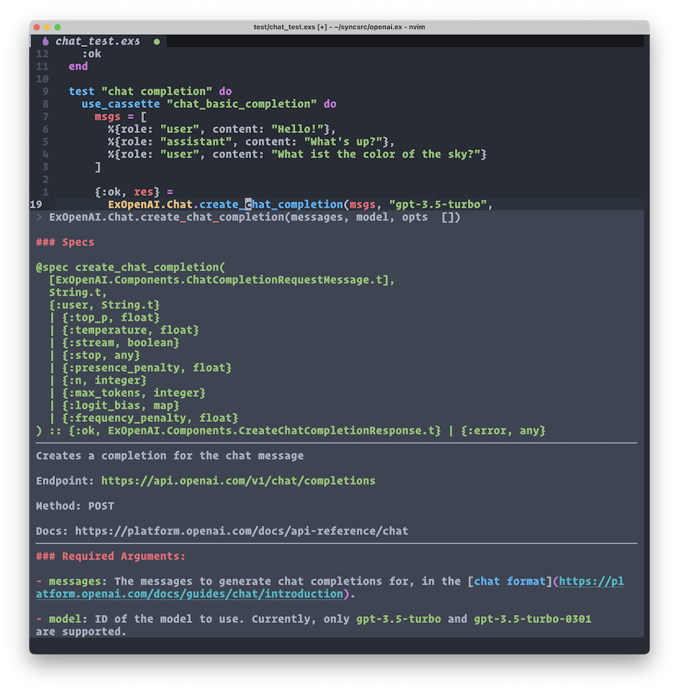

# Elixir SDK for OpenAI APIs

[](https://hex.pm/packages/ex_openai)
[](https://hexdocs.pm/ex_openai)
[](https://hex.pm/packages/ex_openai)

ExOpenAI is an (unofficial) Elixir SDK for interacting with the [OpenAI APIs](https://platform.openai.com/docs/api-reference/introduction)

This SDK is fully auto-generated using [metaprogramming](https://elixirschool.com/en/lessons/advanced/metaprogramming/) and should always reflect the latest state of the OpenAI API.

**Note:** Due to the nature of auto-generating something, you may encounter stuff that isn't working yet. Make sure to report if you notice anything acting up.

- [Elixir SDK for OpenAI APIs](#elixir-sdk-for-openai-apis)
  - [Features](#features)
  - [Installation](#installation)
  - [Supported endpoints (basically everything)](#supported-endpoints-basically-everything)
    - [Editor features: Autocomplete, specs, docs](#editor-features-autocomplete-specs-docs)
      - [Autocompletion/type-hinting through LSP / ElixirSense](#autocompletiontype-hinting-through-lsp--elixirsense)
      - [Typechecking and diagnostics through strict @spec definitions](#typechecking-and-diagnostics-through-strict-spec-definitions)
      - [Inline docs and signatures thanks to @spec and @doc](#inline-docs-and-signatures-thanks-to-spec-and-doc)
  - [To Do's / What's not working yet](#to-dos--whats-not-working-yet)
  - [Configuration](#configuration)
  - [Usage](#usage)
    - [Using ChatGPT APIs](#using-chatgpt-apis)
    - [Using Assistant APIs](#using-assistant-apis)
    - [Usage of endpoints that require files to upload](#usage-of-endpoints-that-require-files-to-upload)
      - [File endpoints that require filename information (Audio transcription)](#file-endpoints-that-require-filename-information-audio-transcription)
    - [Usage of Audio related](#usage-of-audio-related)
    - [Streaming data](#streaming-data)
      - [Streaming with a callback function](#streaming-with-a-callback-function)
      - [Streaming with a separate process](#streaming-with-a-separate-process)
      - [Caveats](#caveats)
  - [How to update once OpenAI changes something?](#how-to-update-once-openai-changes-something)
  - [Some stuff built using this SDK (add yours with a PR!)](#some-stuff-built-using-this-sdk-add-yours-with-a-pr)
  - [How auto-generation works / how can I extend this?](#how-auto-generation-works--how-can-i-extend-this)
  - [License](#license)
  - [Attribution](#attribution)

## Features

- Up-to-date and complete thanks to metaprogramming and code-generation
- Implements _everything_ the OpenAI has to offer
- Strictly follows the official OpenAI APIs for argument/function naming
- Handling of required arguments as function parameters and optional arguments as Keyword list in true Elixir-fashion
- Auto-generated embedded function documentation
- Auto-generated @spec definitions for dialyzer, for strict parameter typing
- Support for streaming responses with SSE

## Installation

Add **_:ex_openai_** as a dependency in your mix.exs file.

```elixir
def deps do
  [
    {:ex_openai, "~> 1.7"}
  ]
end
```

## Supported endpoints (basically everything)

- "/assistants/{assistant_id}"
- "/assistants/{assistant_id}/files/{file_id}"
- "/assistants"
- "/assistants/{assistant_id}/files"
- "/audio/speech"
- "/audio/transcriptions"
- "/audio/translations"
- "/chat/completions"
- "/completions"
- "/edits"
- "/embeddings"
- "/files/{file_id}"
- "/files/{file_id}/content"
- "/files"
- "/fine-tunes/{fine_tune_id}"
- "/fine-tunes/{fine_tune_id}/events"
- "/fine-tunes/{fine_tune_id}/cancel"
- "/fine-tunes"
- "/fine_tuning/jobs"
- "/fine_tuning/jobs/{fine_tuning_job_id}"
- "/fine_tuning/jobs/{fine_tuning_job_id}/events"
- "/fine_tuning/jobs/{fine_tuning_job_id}/cancel"
- "/images/edits"
- "/images/generations"
- "/images/variations"
- "/models/{model}"
- "/models"
- "/moderations"
- "/threads/{thread_id}/messages/{message_id}/files"
- "/threads/{thread_id}"
- "/threads"
- "/threads/{thread_id}/runs/{run_id}/steps"
- "/threads/{thread_id}/messages/{message_id}/files/{file_id}"
- "/threads/{thread_id}/runs/{run_id}/submit_tool_outputs"
- "/threads/{thread_id}/runs/{run_id}/steps/{step_id}"
- "/threads/{thread_id}/messages"
- "/threads/runs"
- "/threads/{thread_id}/messages/{message_id}"
- "/threads/{thread_id}/runs/{run_id}/cancel"
- "/threads/{thread_id}/runs"
- "/threads/{thread_id}/runs/{run_id}"

### Editor features: Autocomplete, specs, docs

#### Autocompletion/type-hinting through LSP / ElixirSense



#### Typechecking and diagnostics through strict @spec definitions



#### Inline docs and signatures thanks to @spec and @doc



## To Do's / What's not working yet

- Streams don't have complete typespecs yet

## Configuration

```elixir
import Config

config :ex_openai,
  # find it at https://platform.openai.com/account/api-keys
  api_key: System.get_env("OPENAI_API_KEY"),
  # find it at https://platform.openai.com/account/api-keys
  organization_key: System.get_env("OPENAI_ORGANIZATION_KEY"),
	# optional, other clients allow overriding via the OPENAI_API_URL/OPENAI_API_BASE environment variable,
	# if unset the the default is https://api.openai.com/v1
  base_url: System.get_env("OPENAI_API_URL"),
  # optional, passed to [HTTPoison.Request](https://hexdocs.pm/httpoison/HTTPoison.Request.html) options
  http_options: [recv_timeout: 50_000],
  # optional, default request headers. The following header is required for Assistant endpoints, which are in beta as of December 2023.
  http_headers: [
    {"OpenAI-Beta", "assistants=v2"}
  ],
  # optional http client, useful for testing purposes on dependent projects
  # if unset the default client is ExOpenAI.Client
  http_client: ExOpenAI.Client
```

You can also pass `base_url`, `api_key` and `organization_key` directly by passing them into the `opts` argument when calling the openai apis:

```elixir
ExOpenAI.Models.list_models(openai_api_key: "abc", openai_organization_key: "def", base_url: "https://cheapai.local")
```

## Usage

Make sure to checkout the docs: https://hexdocs.pm/ex_openai

```elixir
ExOpenAI.Models.list_models
{:ok,
 %{
   data: [
     %{
       "created": 1649358449,
       "id": "babbage",
       "object": "model",
       "owned_by": "openai",
       "parent": nil,
       "permission": [
         %{
           "allow_create_engine": false,
           "allow_fine_tuning": false,
           "allow_logprobs": true,
           "allow_sampling": true,
           "allow_search_indices": false,
           "allow_view": true,
           "created": 1669085501,
           "group": nil,
           "id": "modelperm-49FUp5v084tBB49tC4z8LPH5",
           "is_blocking": false,
           "object": "model_permission",
           "organization": "*"
         }
       ],
       "root": "babbage"
     },
  ...
```

Required parameters are converted into function arguments, optional parameters into the opts keyword list:

```elixir
ExOpenAI.Completions.create_completion "text-davinci-003", "The sky is"
{:ok,
 %{
   choices: [
     %{
       "finish_reason": "length",
       "index": 0,
       "logprobs": nil,
       "text": " blue\n\nThe sky is a light blue hue that may have a few white"
     }
   ],
   created: 1677929239,
   id: "cmpl-6qKKllDPsQRtyJ5oHTbkQVS9w7iKM",
   model: "text-davinci-003",
   object: "text_completion",
   usage: %{
     "completion_tokens": 16,
     "prompt_tokens": 3,
     "total_tokens": 19
   }
 }}
```

### Using ChatGPT APIs

```elixir
msgs = [
  %ExOpenAI.Components.ChatCompletionRequestUserMessage{role: :user, content: "Hello!"},
  %ExOpenAI.Components.ChatCompletionRequestAssistantMessage{role: :assistant, content: "What's up?"},
  %ExOpenAI.Components.ChatCompletionRequestUserMessage{role: :user, content: "What ist the color of the sky?"}
]

{:ok, res} =
  ExOpenAI.Chat.create_chat_completion(msgs, "gpt-3.5-turbo",
    logit_bias: %{
      "8043" => -100
    }
  )
```

### Using Assistant APIs

```elixir
{:ok, assistant} =
	ExOpenAI.Assistants.create_assistant(:"gpt-4o",
		name: "Math Teacher",
		instruction:
			"You are a personal math tutor. Write and run code to answer math questions.",
		tools: [%{type: "code_interpreter"}]
	)

{:ok, thread} = ExOpenAI.Threads.create_thread()

{:ok, _msg} =
	ExOpenAI.Threads.create_message(
		thread.id,
		"I need to solve the equation `3x + 11 = 14`. Can you help me?",
		"user"
	)

{:ok, _run} =
	ExOpenAI.Threads.create_run(
		thread.id,
		assistant.id
	)

# sleep for 5 seconds
# :timer.sleep(5000)

{:ok, messages} = ExOpenAI.Threads.list_messages(thread.id)
```

### Usage of endpoints that require files to upload

Load your file into memory, then pass it into the file parameter

```elixir
duck = File.read!("#{__DIR__}/testdata/duck.png")

{:ok, res} = ExOpenAI.Images.create_image_variation(duck)

IO.inspect(res.data)
```

#### File endpoints that require filename information (Audio transcription)

Some endpoints (like audio transcription) require the original filename so the API knows what the encoding of something is. You can pass a `{filename, bitstring}` tuple into anything that requires a file:

```elixir
audio = File.read!("/Users/david/Downloads/output.wav")
output = ExOpenAI.Audio.create_transcription {"foobar.wav", audio}, "whisper-1"

IO.inspect(output)

{:ok,
 %ExOpenAI.Components.CreateTranscriptionResponse{
   text: "Hello, hello, hello, just a test."
 }}
```

### Usage of Audio related

### Streaming data


You have 2 options to stream data, either by specifying a **callback function** or by specifying a **separate PID**

#### Streaming with a callback function

Pass a callback function to `stream_to` when invoking a call and set `stream:` to `true`:

```elixir
callback = fn
	:finish -> IO.puts "Done"
	{:data, data} -> IO.puts "Data: #{inspect(data)}"
	{:error, err} -> IO.puts "Error: #{inspect(err)}"
end

ExOpenAI.Completions.create_completion "text-davinci-003", "hello world", stream: true, stream_to: callback
```

#### Streaming with a separate process

Create a new client for receiving the streamed data with `use ExOpenAI.StreamingClient`. You'll have to implement the `@behaviour ExOpenAI.StreamingClient` which defines 3 callback functions:

```elixir
defmodule MyStreamingClient do
  use ExOpenAI.StreamingClient

  @impl true
  # callback on data
  def handle_data(data, state) do
    IO.puts("got data: #{inspect(data)}")
    {:noreply, state}
  end

  @impl true
  # callback on error
  def handle_error(e, state) do
    IO.puts("got error: #{inspect(e)}")
    {:noreply, state}
  end

  @impl true
  # callback on finish
  def handle_finish(state) do
    IO.puts("finished!!")
    {:noreply, state}
  end
end
```

Then use it in requests that support streaming by setting `stream: true` and specifying `stream_to: pid`:

```elixir
{:ok, pid} = MyStreamingClient.start_link nil
ExOpenAI.Completions.create_completion "text-davinci-003", "hello world", stream: true, stream_to: pid
```

Your client will now receive the streamed chunks

#### Caveats

- Type information for streamed data is not correct yet. For Completions.create_completion it's fine, however Chat.create_chat_completion requests use a different struct with a `delta` field
- Return types for when setting `stream: true` is incorrect, dialyzer may complain

## How to update once OpenAI changes something?

Run `mix update_openai_docs` and commit the new `docs.yaml` file

## Some stuff built using this SDK (add yours with a PR!)

- [Elixir ChatGPT](https://github.com/dvcrn/elixir-chatgpt)
- https://fixmyjp.d.sh
- https://github.com/dvcrn/gpt-slack-bot
- https://david.coffee/mini-chatgpt-in-elixir-and-genserver/

## How auto-generation works / how can I extend this?

The code got a little complicated but here is the basic gist of it: `codegen.ex` is responsible for parsing the docs.yml file into Elixir types. This is then used in `ex_openai.ex` to generate modules.

The endpoint path is used to generate the group name, for example "/completions" turns into `ExOpenAI.Completions.*`.

1. "parse_component_schema" parses the entire docs.yml file and spits out a bunch of "property" structs that look like this:

```yml
ChatCompletionRequestMessage:
  type: object
  properties:
    role:
      type: string
      enum: ["system", "user", "assistant", "function"]
      description: The role of the messages author. One of `system`, `user`, `assistant`, or `function`.
    content:
      type: string
      nullable: true
      description: The contents of the message. `content` is required for all messages, and may be null for assistant messages with function calls.
    name:
      type: string
      description: The name of the author of this message. `name` is required if role is `function`, and it should be the name of the function whose response is in the `content`. May contain a-z, A-Z, 0-9, and underscores, with a maximum length of 64 characters.
  required:
    - role
    - content
```

... turns into:

```elixir
%{
  description: "",
	kind: :component, # can be 'oneOf' or 'component'
  required_props: [
    %{
      name: "content",
      type: "string",
      description: "The contents of the message. `content` is required for all messages, and may be null for assistant messages with function calls.",
      example: ""
    },
    %{
      name: "role",
      type: {:enum, [:system, :user, :assistant, :function]},
      description: "The role of the messages author. One of `system`, `user`, `assistant`, or `function`.",
      example: ""
    }
  ],
  optional_props: [
    %{
      name: "name",
      type: "string",
      description: "The name of the author of this message. `name` is required if role is `function`, and it should be the name of the function whose response is in the `content`. May contain a-z, A-Z, 0-9, and underscores, with a maximum length of 64 characters.",
      example: ""
    }
  ]
}
```

Important point here: "type" is parsed into an elixir representation that we can work with later. For example `string` -> `string`, or `enum: ["system", "user", "assistant", "function"]` -> `{:enum, [:system, :user, :assistant, :function]}`

2. Type gets constructed by calling `parse_type` from the property parsing. This is a Elixir function with different pattern matching, for example, enum looks like this:

```elixir
  def parse_type(%{"type" => "string", "enum" => enum_entries}),
    do: {:enum, Enum.map(enum_entries, &String.to_atom/1)}
```

3. The final type is converted into a Elixir typespec by calling `type_to_spec`:

```elixir
  def type_to_spec({:enum, l}) when is_list(l) do
    Enum.reduce(l, &{:|, [], [&1, &2]})
  end

  def type_to_spec("number"), do: quote(do: float())
  def type_to_spec("integer"), do: quote(do: integer())
  def type_to_spec("boolean"), do: quote(do: boolean())
```

4. All of this is put together in `ex_openai.ex` to generate the actual modules, the spec is then used to generate documentation.

## License

The package is available as open source under the terms of the [MIT License](https://opensource.org/licenses/MIT).

## Attribution

- Inspired by https://github.com/BlakeWilliams/Elixir-Slack
- Client/config handling from https://github.com/mgallo/openai.ex
