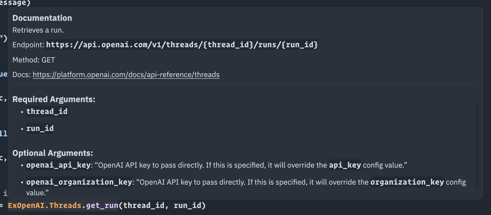

# ExOpenAI

[](https://hex.pm/packages/ex_openai)
[](https://hexdocs.pm/ex_openai)
[](https://hex.pm/packages/ex_openai)

ExOpenAI is an Elixir SDK for interacting with the [OpenAI APIs](https://platform.openai.com/docs/api-reference/introduction)

This SDK is fully auto-generated using [metaprogramming](https://elixirschool.com/en/lessons/advanced/metaprogramming/) and should always reflect the latest state of the OpenAI API.

**Note:** Due to the nature of auto-generating something, you may encounter stuff that isn't working yet. Make sure to report if you notice anything acting up.

## Features

- Up-to-date thanks to metaprogramming
- Strictly following the official OpenAI APIs
- Auto-generated function documentation
- Auto-generated @spec definitions for dialyzer, for strict parameter typing 
- Handling of required arguments as function parameters and optionals as Keyword list

## Installation
Add ***:ex_openai*** as a dependency in your mix.exs file.

```elixir
def deps do
  [
    {:ex_openai, "~> 0.2.1"}
  ]
end
```

## What's working

- All GET/POST requests that don't require handling of stream/file uploads
- Full typespecs for return types and nested types

### Supported endpoints

- /answers
- /chat/completions
- /classifications
- /completions
- /edits
- /embeddings
- /engines/{engine_id}
- /engines
- /files/{file_id}/content
- /fine-tunes/{fine_tune_id}/events
- /fine-tunes/{fine_tune_id}/cancel
- /fine-tunes/{fine_tune_id}
- /fine-tunes
- /images/generations
- /models
- /moderations
- /engines/{engine_id}/search

### Editor features: Autocomplete, specs, docs

#### Autocompletion/type-hinting through LSP / ElixirSense


#### Typechecking and diagnostics through strict @spec definitions


#### Inline docs and signatures thanks to @spec and @doc




## What's not working yet

- Endpoints that expect a file or stream to upload
- DELETE/PUT requests (there are some)
- Typespecs for `oneOf` input types, currently represented as `any()`

### Not yet supported endpoints

- /audio/translations
- /audio/transcriptions
- /files
- /images/variations
- /images/edits

## Configuration

```elixir
import Config

config :ex_openai,
  api_key: "your-api-key", # find it at https://platform.openai.com/account/api-keys
  organization_key: "your-organization-key", # find it at https://platform.openai.com/account/api-keys
  http_options: [recv_timeout: 30_000] # optional, passed to [HTTPoison.Request](https://hexdocs.pm/httpoison/HTTPoison.Request.html) options

```

## Usage

Make sure to checkout the docs: https://hexdocs.pm/ex_openai

```elixir
ExOpenAI.Models.list_models
{:ok,
 %{
   data: [
     %{
       "created": 1649358449,
       "id": "babbage",
       "object": "model",
       "owned_by": "openai",
       "parent": nil,
       "permission": [
         %{
           "allow_create_engine": false,
           "allow_fine_tuning": false,
           "allow_logprobs": true,
           "allow_sampling": true,
           "allow_search_indices": false,
           "allow_view": true,
           "created": 1669085501,
           "group": nil,
           "id": "modelperm-49FUp5v084tBB49tC4z8LPH5",
           "is_blocking": false,
           "object": "model_permission",
           "organization": "*"
         }
       ],
       "root": "babbage"
     },
	...
```

Required parameters are converted into function arguments, optional parameters into the opts keyword list:

```elixir
ExOpenAI.Completions.create_completion "text-davinci-003", prompt: "The sky is"
{:ok,
 %{
   choices: [
     %{
       "finish_reason": "length",
       "index": 0,
       "logprobs": nil,
       "text": " blue\n\nThe sky is a light blue hue that may have a few white"
     }
   ],
   created: 1677929239,
   id: "cmpl-6qKKllDPsQRtyJ5oHTbkQVS9w7iKM",
   model: "text-davinci-003",
   object: "text_completion",
   usage: %{
     "completion_tokens": 16,
     "prompt_tokens": 3,
     "total_tokens": 19
   }
 }}
```

### Using ChatGPT APIs

```elixir
msgs = [
  %{role: "user", content: "Hello!"},
  %{role: "assistant", content: "What's up?"},
  %{role: "user", content: "What ist the color of the sky?"}
]

{:ok, res} =
  ExOpenAI.Chat.create_chat_completion(msgs, "gpt-3.5-turbo",
    logit_bias: %{
      "8043" => -100
    }
  )
```

## How to update once OpenAI changes something?

Run `mix update_openai_docs` and commit the new `docs.yaml` file

## License
The package is available as open source under the terms of the [MIT License](https://opensource.org/licenses/MIT).

## Attribution

- Inspired by https://github.com/BlakeWilliams/Elixir-Slack 
- Client/config handling from https://github.com/mgallo/openai.ex


